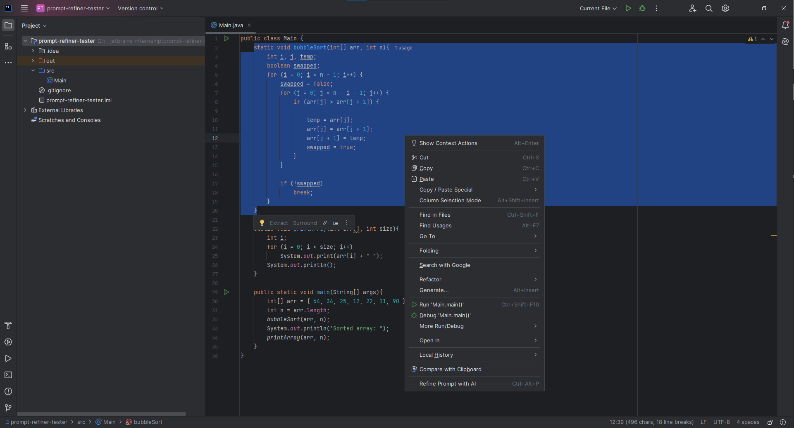
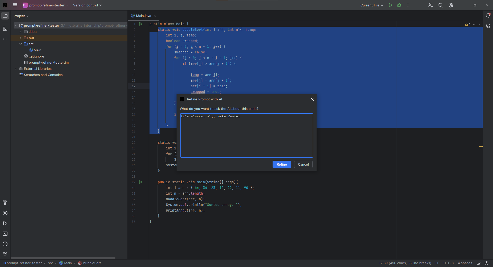
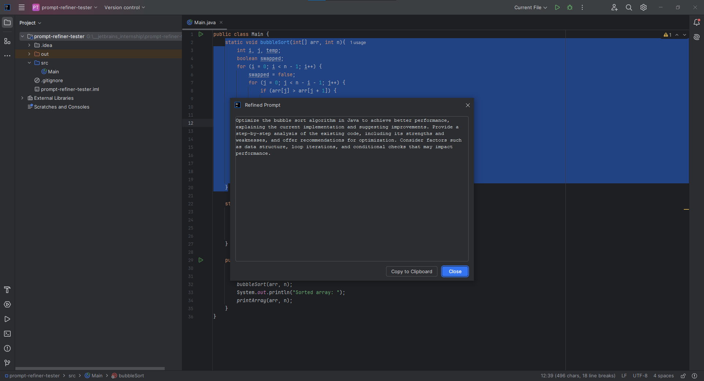

# Prompt Refiner

An IntelliJ Platform plugin that turns a rough developer question into a clear, structured prompt - ready to paste into Claude, ChatGPT, Copilot, or any other coding assistant.

## What it does

Developers waste correction cycles when an AI assistant misunderstands a vague prompt. "Why is this slow?" gets a generic answer; "Can you analyze the time complexity of this `processBatch` method, identify the dominant cost, and suggest a fix that preserves the existing API?" gets a useful one. Writing the second version every time is a chore.

Prompt Refiner removes that chore. Select code in the editor (or don't - the whole file works too), invoke **Refine Prompt with AI** from the right-click menu, the Tools menu, or `Ctrl+Alt+P`, and type your rough question. The plugin sends the question plus the code context to a local LLM running via [Ollama](https://ollama.com), which rewrites it as a structured prompt. The result appears in a dialog with a Copy to Clipboard button.

## Demo





## Setup

1. Install [Ollama](https://ollama.com/download) for your platform.
2. Pull the default model:
   ```
   ollama pull llama3.2:3b
   ```
3. Make sure Ollama is running (`ollama serve`, or just leave the app running on macOS/Windows).
4. From the project root, launch a sandbox IDE with the plugin installed:
   ```
   ./gradlew runIde
   ```

You can change the endpoint, model, timeout, and temperature under **Settings → Tools → Prompt Refiner**.

## Architecture

```
com.github.konwas.promptrefiner
├── action/
│   └── RefinePromptAction       — orchestrates the flow (UI → background task → result dialog)
├── context/
│   ├── EditorContext            — record: code, fileName, language
│   └── EditorContextCollector   — pure logic, extracts context from an Editor
├── llm/
│   ├── LLMClient                — interface, the extensibility seam
│   ├── LLMRequest / LLMResponse — records crossing the client boundary
│   ├── OllamaClient             — HttpClient impl talking to /api/generate
│   └── LLMClientFactory         — reads settings, returns a configured client
├── prompt/
│   └── PromptBuilder            — builds an LLMRequest from context + question
├── settings/
│   ├── PluginSettings           — PersistentStateComponent (endpoint, model, timeout, temperature)
│   └── PluginSettingsConfigurable — Settings UI panel
└── ui/
    ├── InputDialog              — asks for the rough question
    └── ResultDialog             — shows the refined prompt with Copy
```

The `LLMClient` interface is the extensibility seam. It has one method - `refine(LLMRequest)` - and everything above it depends only on the interface, never on `OllamaClient`. Adding a second backend (a hosted Claude API client, a local llama.cpp client) is a one-file change plus a setting to choose between providers.

## Design decisions

- **Why a local LLM (Ollama).** Privacy: the developer's code never leaves their machine. Cost: zero per-call charges. Reproducibility: a pinned model produces stable behavior across machines and over time. No API key required: a new contributor can run the plugin within minutes.
- **Why a provider-agnostic `LLMClient` interface.** It's one extra file today and removes a refactor tomorrow. The interface is deliberately minimal - one method, two records - so there's no API surface to maintain.
- **What context is collected, and why.** The selected code (or the full file if nothing is selected), the file name, and the language tag. The full file is the right default when no selection is made because most "what does this do?" questions are about the file the cursor is in. The language tag goes into the fenced code block so a downstream assistant gets correct syntax highlighting and grammar hints.
